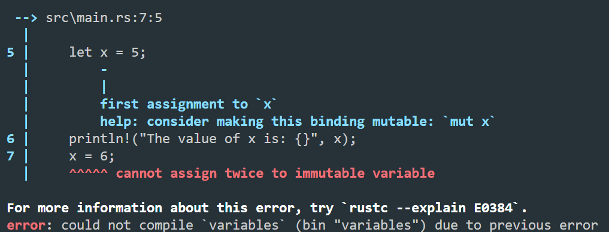
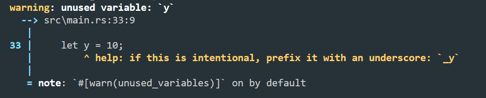
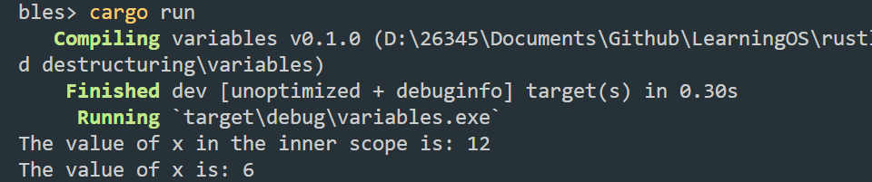

## **变量绑定与解构**
### **变量命名**
在命名方面，和其它语言没有区别，不过当给变量命名时，需要遵循 Rust 命名规范。

```
Rust 语言有一些关键字（keywords），和其他语言一样，这些关键字都是被保留给 Rust 语言使用的，因此，它们不能被用作变量或函数的名称。
```
目前正在使用的关键字
- `as` - 强制类型转换，或use 和 extern crate包和模块引入语句中的重命名
- `break` - 立刻退出循环
- `const` - 定义常量或原生常量指针（constant raw pointer）
- `continue` - 继续进入下一次循环迭代
- `crate` - 链接外部包
- `dyn` - 动态分发特征对象
- `else` - 作为 if 和 if let 控制流结构的 fallback
- `enum` - 定义一个枚举类型
- `extern` - 链接一个外部包,或者一个宏变量(该变量定义在另外一个包中)
- `false` - 布尔值 false
- `fn` - 定义一个函数或 函数指针类型 (function pointer type)
- `for` - 遍历一个迭代器或实现一个 trait 或者指定一个更高级的生命周期
- `if` - 基于条件表达式的结果来执行相应的分支
- `impl` - 为结构体或者特征实现具体功能
- `in` - for 循环语法的一部分
- `let` - 绑定一个变量
- `loop` - 无条件循环
- `match` - 模式匹配
- `mod` - 定义一个模块
- `move` - 使闭包获取其所捕获项的所有权
- `mut` - 在引用、裸指针或模式绑定中使用，表明变量是可变的
- `pub` - 表示结构体字段、impl 块或模块的公共可见性
- `ref` - 通过引用绑定
- `return` - 从函数中返回
- `Self` - 实现特征类型的类型别名
- `self` - 表示方法本身或当前模块
- `static` - 表示全局变量或在整个程序执行期间保持其生命周期
- `struct` - 定义一个结构体
- `super` - 表示当前模块的父模块
- `trait` - 定义一个特征
- `true` - 布尔值 true
- `type` - 定义一个类型别名或关联类型
- `unsafe` - 表示不安全的代码、函数、特征或实现
- `use` - 在当前代码范围内(模块或者花括号对)引入外部的包、模块等
- `where` - 表示一个约束类型的从句
- `while` - 基于一个表达式的结果判断是否继续循环
保留做将来使用的关键字

如下关键字没有任何功能，不过由 Rust 保留以备将来的应用。

`abstract /` `async /` `await /` `become /` `box /` `do /` `final /` `macro /` `override /` `priv /` `try /` `typeof /` `unsized /` `virtual /` `yield`

#### **变量绑定**
在 Rust 中，我们这样写： let a = "hello world" ，同时给这个过程起了另一个名字：变量绑定。

这里就涉及 Rust 最核心的原则——所有权，简单来讲，任何内存对象都是有主人的，而且一般情况下完全属于它的主人，绑定就是把这个对象绑定给一个变量，让这个变量成为它的主人（在这种情况下，该对象之前的主人就会丧失对该对象的所有权）。
#### **变量可变性**
Rust 的变量在默认情况下是不可变的。这可以让我们编写的代码更安全，性能也更好。当然也可以通过 mut 关键字让变量变为可变的，让设计更灵活。

##### **新建项目`Variables`进行测试**
在工程目录下使用 `cargo new variables` 新建一个项目，项目名为 `variables` 。

然后在新建的 `variables` 目录下，编辑 `src/main.rs `：
```rust
fn main() {
    let x = 5;
    println!("The value of x is: {}", x);
    x = 6;
    println!("The value of x is: {}", x);
}
```
保存文件进行编译`cargo build`，会出现错误提示：



具体的错误原因是 `cannot assign twice to immutable variable x`（无法对不可变的变量进行重复赋值），因为我们想为不可变的 x 变量再次赋值。

这种错误是为了避免无法预期的错误发生在我们的变量上：一个变量往往被多处代码所使用，其中一部分代码假定该变量的值永远不会改变，而另外一部分代码却无情的改变了这个值，在实际开发过程中，这个错误是很难被发现的，特别是在多线程编程中。

在 Rust 中，可变性很简单，只要在变量名前加一个 mut 即可(同时这种显式的声明方式还会传达这样的信息：这个变量在后面代码部分会发生改变)。

为了让变量声明为可变,将 `src/main.rs` 改为以下内容：
```rust
fn main() {
    let mut x = 5;
    println!("The value of x is: {}", x);
    x = 6;
    println!("The value of x is: {}", x);
}
```
得到结果：
```
$ cargo run
    Finished dev [unoptimized + debuginfo] target(s) in 0.01s
     Running `target\debug\variables.exe`
The value of x is: 5
The value of x is: 6
```
选择可变还是不可变，更多的还是取决于你的使用场景，例如不可变可以带来安全性，但是丧失了灵活性和性能（如果你要改变，就要重新创建一个新的变量，这里涉及到内存对象的再分配）。而可变变量最大的好处就是使用上的灵活性和性能上的提升。

#### **使用下划线开头忽略未使用的变量**
当我们正在设计原型或刚刚开始一个项目。这时希望告诉 Rust 不要警告未使用的变量，为此可以用下划线作为变量名的开头：
```rust
fn main() {
    let _x = 5;
    let y = 10;
}
```
编译运行得到结果：


### **变量解构**
let 表达式不仅仅用于变量的绑定，还能进行复杂变量的解构：从一个相对复杂的变量中，匹配出该变量的一部分内容：
```rust
fn main() {
    let (a, mut b): (bool,bool) = (true, false);
    // a = true,不可变; b = false，可变
    println!("a = {:?}, b = {:?}", a, b);

    b = true;
    assert_eq!(a, b);
}
```
编译运行结果：
`a = true, b = false`
#### **解构式赋值**
在赋值语句的左式中使用元组、切片和结构体模式，这种赋值方式被称为解构式赋值（destructuring assignment）。
```rust
struct Struct {
    e: i32
}

fn main() {
    let (a, b, c, d, e);

    (a, b) = (1, 2);
    // _ 代表匹配一个值，但是我们不关心具体的值是什么，因此没有使用一个变量名而是使用了 _
    [c, .., d, _] = [1, 2, 3, 4, 5];
    Struct { e, .. } = Struct { e: 5 };

    assert_eq!([1, 2, 1, 4, 5], [a, b, c, d, e]);
}
```
需要注意的是，使用 `+=` 的赋值语句还不支持解构式赋值。
(在阅读过程中虽然暂时看不懂该模式匹配的语法，但并不妨碍对解构式赋值的了解。)
#### **通过Github Copilot对该函数的理解：**
这段 Rust 代码演示了解构的用法。首先定义了一个结构体 `Struct`，其中包含一个 i32 类型的字段 e。然后在 `main` 函数中，定义了五个变量 a、b、c、d 和 e，但是没有给它们赋值。

接着，使用解构将 (1, 2) 中的值分别赋给 a 和 b。这里的括号可以省略，因为解构的语法本身就可以表示一个元组。

然后，使用解构将 [1, 2, 3, 4, 5] 中的第一个值赋给 c，最后一个值赋给 _（这里使用 _ 表示我们不关心具体的值是什么），中间的值赋给 d。这里使用了 Rust 中的 `slice` 模式，其中 .. 表示匹配任意数量的元素。

最后，使用解构将 `Struct { e: 5 }` 中的 e 字段的值赋给 e。这里使用了 Rust 中的结构体模式，其中 .. 表示匹配结构体中的其它字段，但是我们不关心它们的值。

最后，使用 `assert_eq!` 宏检查解构后的变量值是否与预期值相等。如果相等，则程序正常退出，否则会抛出一个 panic。
### **变量和常量之间的关系**
与不可变变量一样，常量也是绑定到一个常量名且不允许更改的值，但是常量和不可变变量之间存在一些差异：
- 常量不允许使用 mut。常量不仅仅默认不可变，而且自始至终不可变，因为常量在编译完成后，已经确定它的值。
- 常量使用 const 关键字而不是 let 关键字来声明，并且值的类型必须标注。

下面是一个常量声明的例子，其常量名为 MAX_POINTS，值设置为 100,000。（Rust 常量的命名约定是全部字母都使用大写，并使用下划线分隔单词，另外对数字字面量可插入下划线以提高可读性）：

`const MAX_POINTS: u32 = 100_000;`

常量可以在任意作用域内声明，包括全局作用域，在声明的作用域内，常量在程序运行的整个过程中都有效。

### **变量遮蔽(shadowing)**
Rust 允许声明相同的变量名，在后面声明的变量会遮蔽掉前面声明的，如下所示：
```rust
fn main() {
    let x = 5;
    // 在main函数的作用域内对之前的x进行遮蔽
    let x = x + 1;

    {
        // 在当前的花括号作用域内，对之前的x进行遮蔽
        let x = x * 2;
        println!("The value of x in the inner scope is: {}", x);
    }

    println!("The value of x is: {}", x);
}
```
这个程序首先将数值 5 绑定到 x，然后通过重复使用 let x = 来遮蔽之前的 x，并取原来的值加上 1，所以 x 的值变成了 6。第三个 let 语句同样遮蔽前面的 x，取之前的值并乘上 2，得到的 x 最终值为 12。运行此程序：



这和 mut 变量的使用是不同的，第二个 let 生成了完全不同的新变量，两个变量只是恰好拥有同样的名称，涉及一次内存对象的再分配 ，而 mut 声明的变量，可以修改同一个内存地址上的值，并不会发生内存对象的再分配，性能要更好。