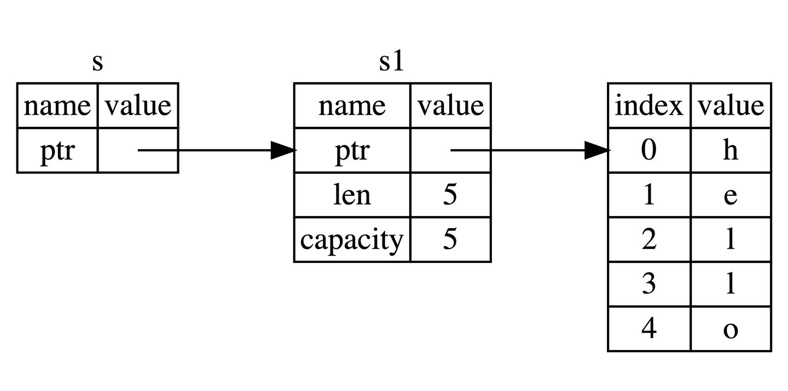

### **引用和借用**
Rust 通过`借用(Borrowing)`这个概念来达成上述的目的，**获取变量的引用，称之为借用(borrowing)**。正如现实生活中，如果一个人拥有某样东西，你可以从他那里借来，当使用完毕后，也必须要物归原主。

#### **引用和解引用**
常规引用是一个指针类型，指向了对象存储的内存地址。在下面代码中，我们创建一个 i32 值的引用 y，然后使用解引用运算符来解出 y 所使用的值:
```rust
fn main() {
    let x = 5;
    let y = &x;

    assert_eq!(5, x);
    assert_eq!(5, *y);
}
```
变量`x`存放了一个`i32` 值 5。`y`是`x`的一个引用。可以断言`x`等于 5。然而，如果希望对`y`的值做出断言，必须使用`*y`来解出引用所指向的值（也就是解引用）。一旦解引用了`y`，就可以访问`y`所指向的整型值并可以与 5 做比较。

若直接对`y`做断言，会得到一个错误:
```bash
error[E0277]: can not compare `{integer}` with `&{integer}`
 --> src/main.rs:6:5
  |
6 |     assert_eq!(5, y);
  |     ^^^^^^^^^^^^^^^^^ no implementation for `{integer} == &{integer}` // 无法比较整数类型和引用类型
  |
  = help: the trait `std::cmp::PartialEq<&{integer}>` is not implemented for
  `{integer}`
```
这是因为`y`是一个引用，而不是一个整型值。Rust 无法比较一个整型值和一个引用，因为它们是不同的类型。如果想要比较`y`的值，必须先解引用`y`，这样就可以得到一个整型值，然后再与 5 做比较。

#### **不可变引用**
下面的代码，我们用 `s1`的引用作为参数传递给 `calculate_length` 函数，而不是把 `s1` 的所有权转移给该函数：
```rust
fn main() {
    let s1 = String::from("hello");

    let len = calculate_length(&s1);

    println!("The length of '{}' is {}.", s1, len);
}

fn calculate_length(s: &String) -> usize {
    s.len()
}
```
函数签名中的 `&` 表示参数 `s` 是一个引用，而不是一个值。因此，无需在函数体中获取 `s` 的所有权。函数体中的 `&s.len()` 语法与 `s.len()` 语法的效果相同，不过 `&s.len()` 更清晰。接着，我们将 `s` 的类型修改为 `&String` 而不是 `&str`，这样就可以在需要的时候打印出更多有用的信息了：

注意到两点：

- 无需像上章一样：先通过函数参数传入所有权，然后再通过函数返回来传出所有权，代码更加简洁
- `calculate_length`的参数`s`类型从 `String` 变为 `&String`

`&`符号即是引用，它们允许你使用值，但是不获取所有权，如图所示：


通过 &s1 语法，我们创建了一个指向 s1 的引用，但是并不拥有它。因为并不拥有这个值，当引用离开作用域后，其指向的值也不会被丢弃。

同理，函数 calculate_length 使用 & 来表明参数 s 的类型是一个引用：
```rust
fn calculate_length(s: &String) -> usize { // s 是对 String 的引用
    s.len()
} // 这里，s 离开了作用域。但因为它并不拥有引用值的所有权，
  // 所以什么也不会发生
```
如果尝试修改借用的变量：
```rust
fn main() {
    let s = String::from("hello");

    change(&s);
}

fn change(some_string: &String) {
    some_string.push_str(", world");
    println!("{}", some_string);
}
```
会得到一个错误：
```bash
error[E0596]: cannot borrow `*some_string` as mutable, as it is behind a `&` reference
 --> src/main.rs:8:5
  |
7 | fn change(some_string: &String) {
  |                        ------- help: consider changing this to be a mutable reference: `&mut String`
                           ------- 帮助：考虑将该参数类型修改为可变的引用: `&mut String`
8 |     some_string.push_str(", world");
  |     ^^^^^^^^^^^ `some_string` is a `&` reference, so the data it refers to cannot be borrowed as mutable
                     `some_string`是一个`&`类型的引用，因此它指向的数据无法进行修改
```

#### **可变引用**
只需要一个小调整，即可修复上面代码的错误：
```rust
fn main() {
    let mut s = String::from("hello");

    change(&mut s);
}

fn change(some_string: &mut String) {
    some_string.push_str(", world");
}
```
声明 `s` 是可变类型，其次创建一个可变的引用 `&mut s` 和接受可变引用参数 `some_string: &mut String` 的函数。

##### **可变引用同时只能存在一个**
不过可变引用并不是随心所欲、想用就用的，它有一个很大的限制： **同一作用域，特定数据只能有一个可变引用**：
```rust
let mut s = String::from("hello");

let r1 = &mut s;
let r2 = &mut s;

println!("{}, {}", r1, r2);
```
这段代码会报错的原因是，Rust 不允许在特定作用域中同时存在可变和不可变引用。因为这两个引用都可以修改数据，所以如果同时拥有可变引用就可能造成数据竞争。

第一个可变借用`r1`必须要持续到最后一次使用的位置 `println!`，在 `r1`创建和最后一次使用之间，我们又尝试创建第二个可变借用`r2`。

这种限制的好处就是使 Rust 在编译期就避免数据竞争，数据竞争可由以下行为造成：

- 两个或更多的指针同时访问同一数据
- 至少有一个指针被用来写入数据
- 没有同步数据访问的机制

数据竞争会导致未定义行为，难以追踪的 bug 和 Rust 无法保证的行为。Rust 通过不允许程序进入存在数据竞争的状态来保证内存安全。

有时候大括号可以帮我们解决一些编译错误，因为它们允许我们在拥有不同的作用域时，拥有多个可变引用，例如：
```rust
let mut s = String::from("hello");

{
    let r1 = &mut s;

} // r1 在这里离开了作用域，所以我们完全可以创建一个新的引用
let r2 = &mut s;
```
这段代码是可以正常运行的，因为拥有不同的作用域，所以可以拥有多个可变引用，但是不能同时拥有。

##### **可变引用和不可变引用不能同时存在**
下面的代码也会报错：
```rust
let mut s = String::from("hello");

let r1 = &s; // 没问题
let r2 = &s; // 没问题
let r3 = &mut s; // 大问题

println!("{}, {}, and {}", r1, r2, r3);
```
错误如下：
```bash
error[E0502]: cannot borrow `s` as mutable because it is also borrowed as immutable
        // 无法借用可变 `s` 因为它已经被借用了不可变
 --> src/main.rs:6:14
  |
4 |     let r1 = &s; // 没问题
  |              -- immutable borrow occurs here 不可变借用发生在这里
5 |     let r2 = &s; // 没问题
6 |     let r3 = &mut s; // 大问题
  |              ^^^^^^ mutable borrow occurs here 可变借用发生在这里
7 |
8 |     println!("{}, {}, and {}", r1, r2, r3);
  |                                -- immutable borrow later used here 不可变借用在这里使用
```
这个错误的原因是，可变引用`r3`在不可变引用`r1`和`r2`之后被定义。这种情况下，就不能再创建新的引用了，因为不可变引用的用户并不知道其他的引用。不过反过来先创建可变引用再创建不可变引用就是可行的，因为可变引用的用户可能需要数据是可变的。

举个例子，正在借用不可变引用的用户，肯定不希望他借用的东西，被另外一个人莫名其妙改变了。多个不可变借用被允许是因为没有人会去试图修改数据，每个人都只读这一份数据而不做修改，因此不用担心数据被污染。


>注意，引用的作用域 s 从创建开始，一直持续到它最后一次使用的地方，这个跟变量的作用域有所不同，变量的作用域从创建持续到某一个花括号"}"结束。


事实上，Rust 编译器允许我们同时拥有多个不可变引用，只要它们不在同一作用域内即可。下面的代码是可以正常运行的：
```rust
fn main() {
   let mut s = String::from("hello");

    let r1 = &s;
    let r2 = &s;
    println!("{} and {}", r1, r2);
    // 新编译器中，r1,r2作用域在这里结束

    let r3 = &mut s;
    println!("{}", r3);
} // 老编译器中，r1、r2、r3作用域在这里结束
  // 新编译器中，r3作用域在这里结束
```
在老版本的编译器因为`r1`和`r2`的作用域在花括号`}`处结束，那么`r3`的借用就会触发**无法同时借用可变和不可变的规则**。

但是在新编译器中，`r1`和`r2`的作用域在`println!`处结束，所以`r3`的借用就不会触发**无法同时借用可变和不可变的规则**。

#### **NLL**
Rust 2018 版本引入了 NLL（non-lexical lifetimes，非词法生命周期），它可以让编译器更智能地分析引用的作用域，从而避免了一些不必要的错误。上面的代码在新编译器中是可以正常运行的，因为`r1`和`r2`的作用域在`println!`处结束，所以`r3`的借用就不会触发**无法同时借用可变和不可变的规则**。

#### **悬垂引用(Dangling References)**
悬垂引用（dangling reference）是指当一个引用指向了其数据所在内存已经被释放的空间。为了避免悬垂引用，Rust 编译器确保引用永远也不会变成悬垂状态：当创建了一个指向某个值的引用后，该值将会一直保持被借用状态，直到引用离开了其作用域为止。当你获取数据的引用后，编译器可以确保数据不会在引用结束前被释放，要想释放数据，必须先停止其引用的使用。

我们尝试创建一个悬垂引用，Rust 会抛出一个编译时错误：
```rust
fn main() {
    let reference_to_nothing = dangle();
}
fn dangle() -> &String { // dangle 返回一个字符串的引用
    let s = String::from("hello"); // s 是一个新字符串
    &s // 返回字符串 s 的引用
} // 这里 s 离开作用域并被丢弃。其内存被释放。
  // 危险！
```
这段代码会报错：
```bash
error[E0106]: missing lifetime specifier
 --> src/main.rs:5:16
  |
5 | fn dangle() -> &String {
  |                ^ expected named lifetime parameter
  |
  = help: this function's return type contains a borrowed value, but there is no value for it to be borrowed from
help: consider using the `'static` lifetime
  |
5 | fn dangle() -> &'static String {
  |                ~~~~~~~~

```
这个错误的原因是，我们尝试返回一个`String`的引用，但是它的值在函数离开作用域后就被释放了，所以编译器不知道该返回什么。

#### **解引用裸指针**
仔细看看 dangle 代码的每一步：
```rust
fn dangle() -> &String { // dangle 返回一个字符串的引用

    let s = String::from("hello"); // s 是一个新字符串

    &s // 返回字符串 s 的引用
} // 这里 s 离开作用域并被丢弃。其内存被释放。
  // 危险！
```
因为`s`是在`dangle`函数内创建的，当`dangle`的代码执行完毕后，`s`将被释放，但是此时我们又尝试去返回它的引用。这意味着这个引用会指向一个无效的`String`。

其中一个很好的解决办法就是直接返回`String`:
```rust
fn no_dangle() -> String {
    let s = String::from("hello");

    s
}
```
最终 `String` 的所有权被转移给外面的调用者。

#### **借用规则总结**
总的来说，借用规则如下：

- 同一时刻，你只能拥有要么一个可变引用, 要么任意多个不可变引用
- 引用必须总是有效的

